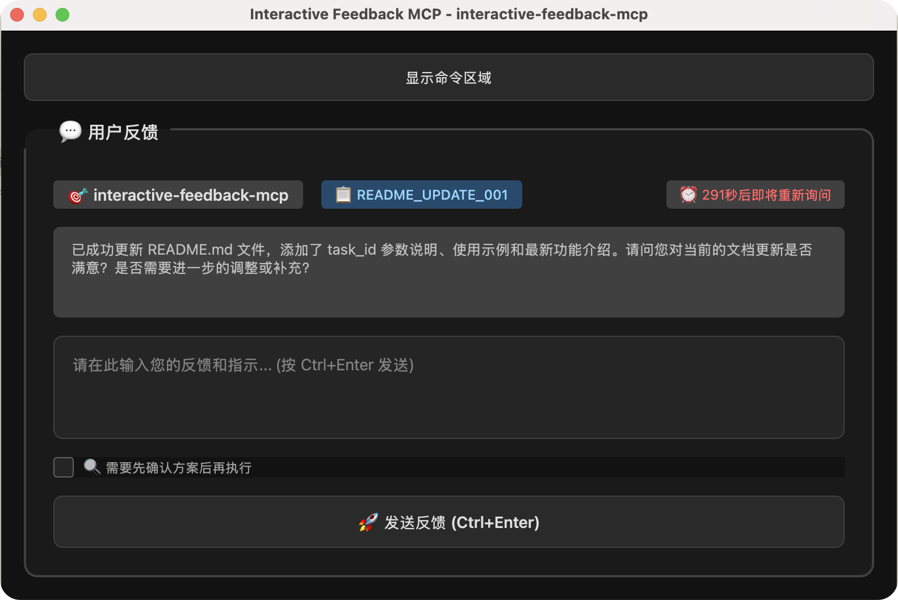

# Interactive Feedback MCP

fork 自 https://github.com/noopstudios/interactive-feedback-mcp.git

## 🚀 优化和更改

1. **优化UI样式** - 提升用户界面美观性和用户体验
2. **新增自动在规定时间内重新调用工具以延续对话** - Cursor等IDE有会话超时时间限制，当超时后在该工具中输入提交后会直接报错，在超时时间内进行自动重新调用可以使会话始终保持活跃，持续等待用户输入新的下一步指令，从而达到一次请求在较长一段时间内仍能完成多次任务的需求
3. **新增显示当前项目以用于多窗口时的区分** - 便于在多项目同时开发时快速识别当前操作的项目
4. **支持环境变量配置** - 支持通过环境变量配置自动重新调用时间



## 📖 项目简介

这是一个[MCP Server](https://modelcontextprotocol.io/)，用于在AI辅助开发工具中实现人机交互工作流，如[Cursor](https://www.cursor.com)。该服务器允许您运行命令、查看输出，并直接向AI提供文本反馈。也兼容[Cline](https://cline.bot)和[Windsurf](https://windsurf.com)。

## 💡 为什么使用这个工具？

通过引导AI助手在进行推测性、高成本的工具调用前先与用户确认，这个模块可以大幅减少Cursor等平台上的高级请求次数（例如OpenAI工具调用）。在某些情况下，它可以将原本需要25个工具调用的工作整合为单个反馈感知请求——节省资源并提升性能。

## 安装说明 (Cursor)

1. **先决条件：**
    * Python 3.11 或更新版本
    * [uv](https://github.com/astral-sh/uv) (Python包管理器)。安装方法：
        * Windows: `pip install uv`
        * Linux/Mac: `curl -LsSf https://astral.sh/uv/install.sh | sh`

2. **获取代码：**
    * 克隆此仓库：
        `git clone https://github.com/your-username/interactive-feedback-mcp.git`
    * 或下载源代码

3. **进入目录：**
    * `cd path/to/interactive-feedback-mcp`

4. **安装依赖：**
    * `uv sync` (这将创建虚拟环境并安装包)

5. **运行MCP服务器：**
    * `uv run server.py`

6. **在Cursor中配置：**
    * Cursor通常允许在其设置中指定自定义MCP服务器。您需要将Cursor指向此正在运行的服务器。具体机制可能有所不同，请查阅Cursor文档了解如何添加自定义MCP。
    * **手动配置（例如通过`mcp.json`）**
        **请将`/Users/fabioferreira/Dev/scripts/interactive-feedback-mcp`路径更改为您系统中克隆仓库的实际路径。**

        ```json
        {
          "mcpServers": {
            "interactive-feedback-mcp": {
              "command": "uv",
              "args": [
                "--directory",
                "/Users/your-path/interactive-feedback-mcp",
                "run",
                "server.py"
              ],
              "timeout": 600,
              "autoApprove": [
                "interactive_feedback"
              ]
            }
          }
        }
        ```

### 对于 Cline / Windsurf

类似设置原则适用。您可以在相应工具的MCP设置中配置服务器命令（例如使用正确`--directory`参数指向项目目录的`uv run server.py`），使用`interactive-feedback-mcp`作为服务器标识符。

## 配置

### 环境变量配置

您可以通过设置环境变量来自定义行为：

* `INTERACTIVE_FEEDBACK_TIMEOUT_SECONDS`: 设置自动反馈的超时时间（秒），默认为290秒（约4分50秒）。这个值控制用户界面显示多长时间后自动提交反馈。

例如，在您的MCP配置文件（如 `~/.cursor/mcp.json` 或其他IDE的MCP配置）中可以这样设置：

```json
{
  "mcpServers": {
    "interactive-feedback-mcp": {
      "command": "uv",
      "args": [
        "--directory",
        "/path/to/interactive-feedback-mcp",
        "run",
        "server.py"
      ],
      "env": {
        "INTERACTIVE_FEEDBACK_TIMEOUT_SECONDS": "600"
      },
      "timeout": 60000,
      "autoApprove": [
        "interactive_feedback"
      ]
    }
  }
}
```

#### 配置建议

* **快速反馈场景**：设置较短的超时时间，如 `90` 或 `120` 秒，适合简单的确认操作
* **复杂任务场景**：设置较长的超时时间，如 `600` 或 `900` 秒，给用户更多时间考虑和输入详细反馈
* **默认值**：如果不设置此环境变量，默认使用 `290` 秒（约4分50秒）(cursor 会话超时时间5分钟)

**注意**：`timeout` 字段（这里设置为60000毫秒）是MCP客户端的超时设置，与自动反馈超时是不同的概念。前者控制整个MCP请求的超时时间，后者控制用户界面的自动反馈时间，用于保持活跃。

### 项目配置

此MCP服务器使用Qt的`QSettings`按项目存储配置。这包括：
* 要运行的命令
* 是否在下次启动时为此项目自动执行命令（参见"Execute automatically on next run"复选框）
* 命令部分的可见性状态（显示/隐藏）（切换时立即保存）
* 窗口几何和状态（一般UI偏好）

这些设置通常存储在特定于平台的位置（例如Windows上的注册表、macOS上的plist文件、Linux上`~/.config`或`~/.local/share`中的配置文件），组织名称为"FabioFerreira"，应用程序名称为"InteractiveFeedbackMCP"，每个项目目录有唯一的组。

UI中的"Save Configuration"按钮主要保存命令输入字段中输入的当前命令和活动项目的"Execute automatically on next run"复选框状态。命令部分的可见性在切换时自动保存。应用程序关闭时保存一般窗口大小和位置。

## 开发

要在开发模式下运行服务器并带有用于测试的Web界面：

```sh
uv run fastmcp dev server.py
```

这将打开Web界面并允许您与MCP工具交互进行测试。

## 可用工具

以下是AI助手如何调用`interactive_feedback`工具的示例：

```xml
<use_mcp_tool>
  <server_name>interactive-feedback-mcp</server_name>
  <tool_name>interactive_feedback</tool_name>
  <arguments>
    {
      "project_directory": "/path/to/your/project",
      "summary": "I've implemented the changes you requested and refactored the main module."
    }
  </arguments>
</use_mcp_tool>
```